

<h3>Exploring Machine Learning, Data Science, and NLP to create practical, impactful solutions</h3>

---

### 🔭 What I'm working on
Exploring practical applications of Artificial Intelligence, with an emphasis on turning models into solutions that move beyond prototypes and deliver meaningful impact.

### 🌱 What I'm learning right now
Currently learning Machine Learning, Data Science, Workflow Automation, Natural Language Processing, and expanding into emerging AI approaches.

### 🤝 Open to
Open to contributing to collaborative projects and connecting with peers who can support deeper technical growth through shared knowledge and experience.

---

### 🛠️ Core Stack

**Programming Languages:**

**Frameworks & Libraries:**

**Tools:**

---

### 📌 Featured Projects

<picture>
  <source media="(prefers-color-scheme: dark)" srcset="https://github-readme-stats.vercel.app/api/pin/?username=shahzeb121-oss&repo=FaceGuard-Pro&hide_border=false&border_color=a371f7&bg_color=0d1117&title_color=a371f7&icon_color=58a6ff&text_color=c9d1d9">
  
</picture>
<picture>
  <source media="(prefers-color-scheme: dark)" srcset="https://github-readme-stats.vercel.app/api/pin/?username=shahzeb121-oss&repo=spam-filter-app&hide_border=false&border_color=a371f7&bg_color=0d1117&title_color=a371f7&icon_color=58a6ff&text_color=c9d1d9">
  
</picture>
<picture>
  <source media="(prefers-color-scheme: dark)" srcset="https://github-readme-stats.vercel.app/api/pin/?username=shahzeb121-oss&repo=first-aid-ai&hide_border=false&border_color=a371f7&bg_color=0d1117&title_color=a371f7&icon_color=58a6ff&text_color=c9d1d9">
  
</picture>

- **[FaceGuard-Pro](https://github.com/Shahzeb121-oss/FaceGuard-Pro)** — Real-time CNN-based face detection using OpenCV DNN (ResNet-10 SSD), supporting webcam, image, and video input, with a CustomTkinter desktop UI.
- **[Spam Filter App](https://github.com/Shahzeb121-oss/spam-filter-app)** — Email spam & phishing detector combining a Naive Bayes + TF-IDF classifier with rule-based heuristics, served via a Flask API with a live triage dashboard.
- **[First Aid AI](https://github.com/Shahzeb121-oss/first-aid-ai)** — AI-powered first aid assistant that gives quick emergency guidance and basic medical support information.

---

### 📜 Certifications

**🤖 AI & Machine Learning**

<a href="https://verify.skilljar.com/c/9f4w2bqe7csi">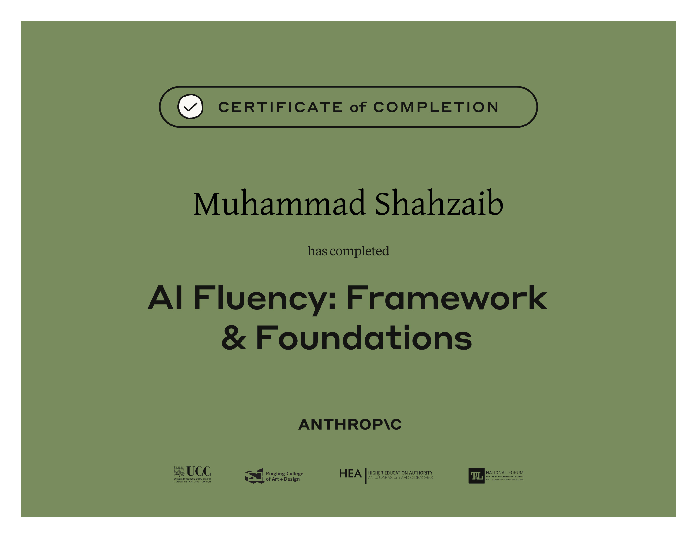</a>
<a href="https://www.coursera.org/account/accomplishments/specialization/PKZCLA6OA0QD">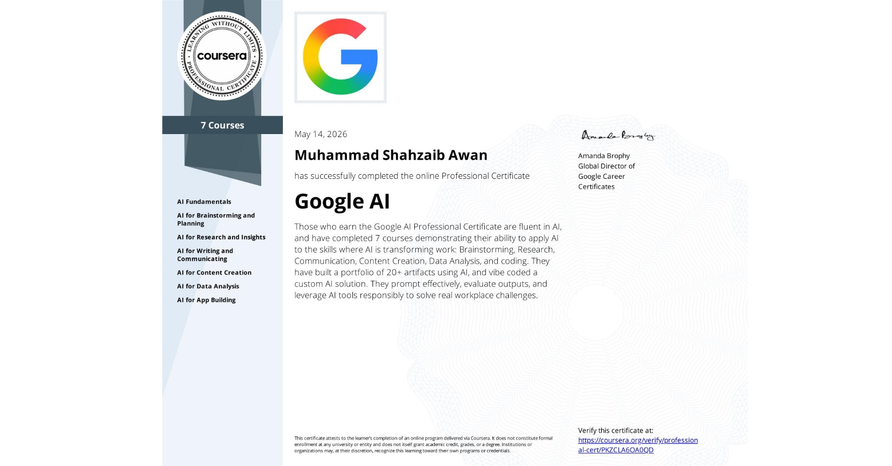</a>

<a href="https://www.linkedin.com/learning/certificates/6053124f905ce9a3ae579f7e47b37efdc7507d39d4afa6fab9b6140c7115e759/">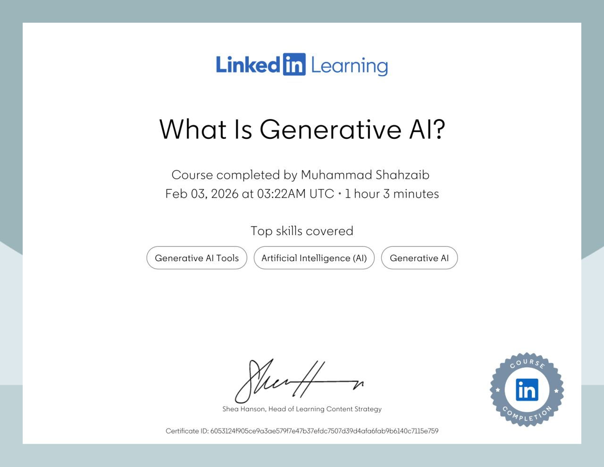</a>
<a href="https://media.geeksforgeeks.org/courses/certificates/d8543e8a67a4d90346f2a2d1913e7235.pdf">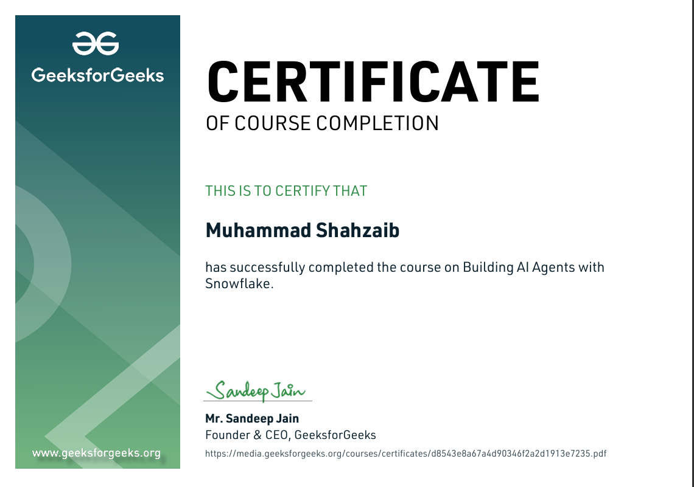</a>

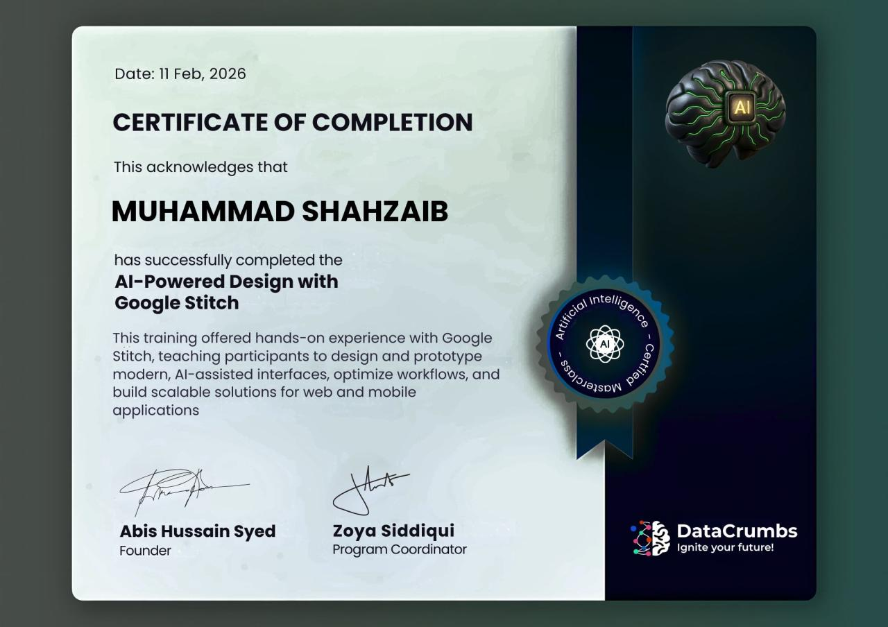
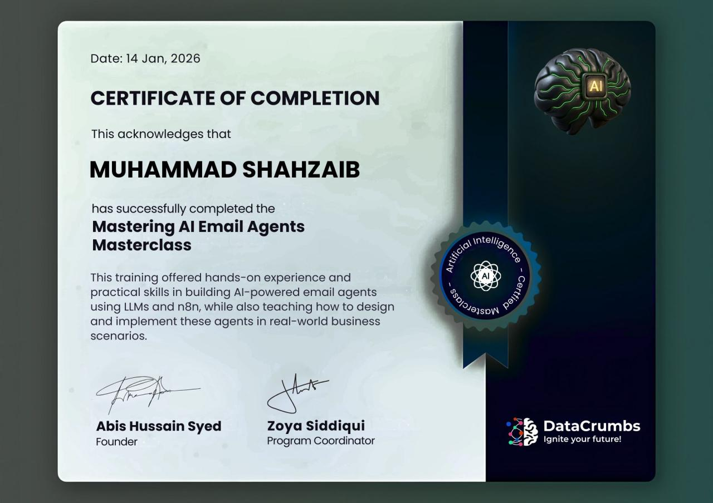

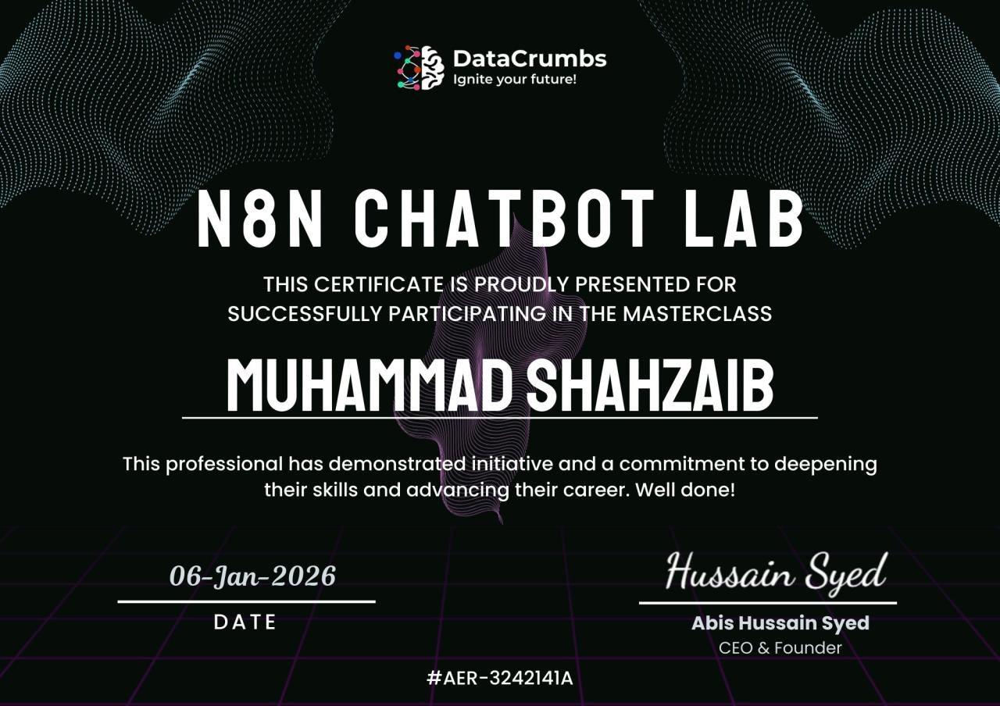

**📊 Data Science & Analytics**

<a href="https://www.coursera.org/account/accomplishments/specialization/8Y2DQ4NOXAWK">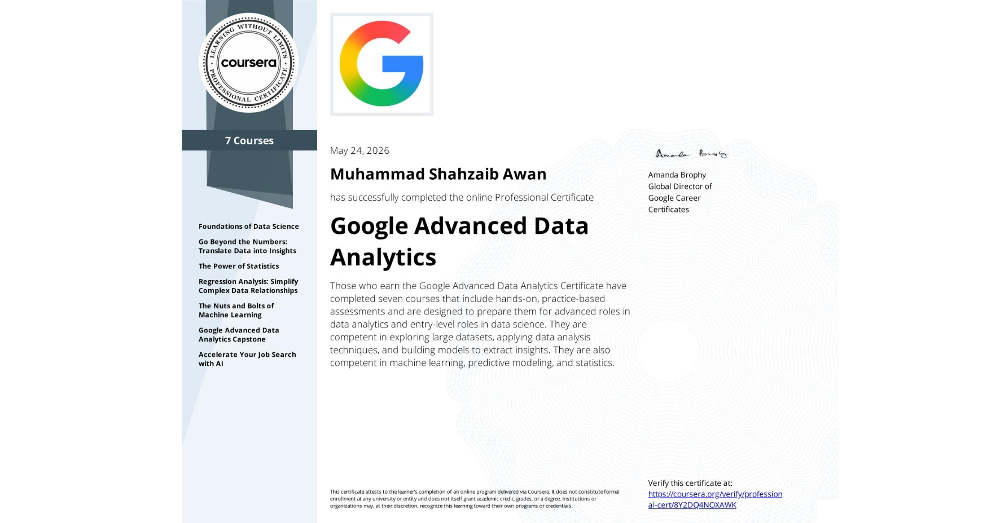</a>
<a href="https://coursera.org/share/731510ab56142677507f774dd9d85fbb">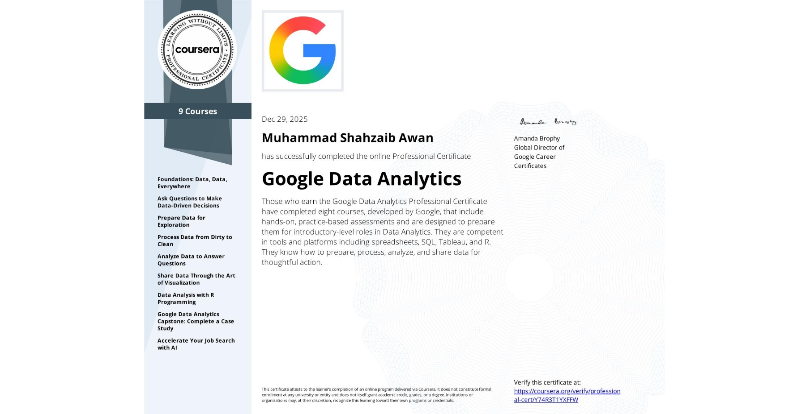</a>

<a href="https://www.life-global.org/certificate/f7c9c0b3-4035-4793-8634-617a91b4f438">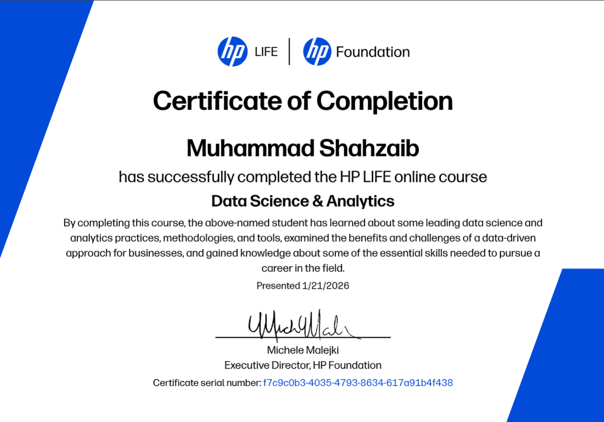</a>

**💻 IT, Automation & Design**

<a href="https://www.coursera.org/account/accomplishments/specialization/MYX366FMLIUY">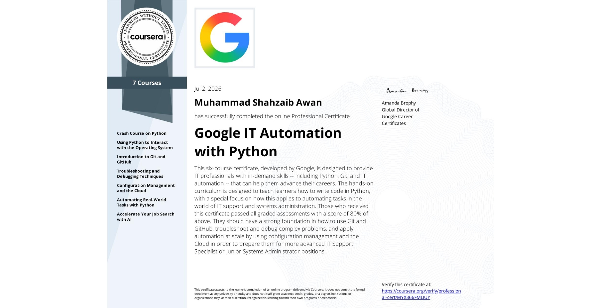</a>

<a href="https://coursera.org/share/fa2fa7df683a24d2869e354aba686d86">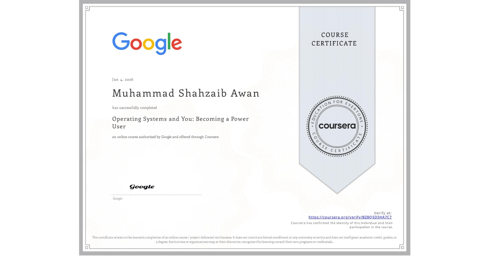</a>
<a href="https://coursera.org/share/3a70add422b6087e8dfd0d848edabf2c">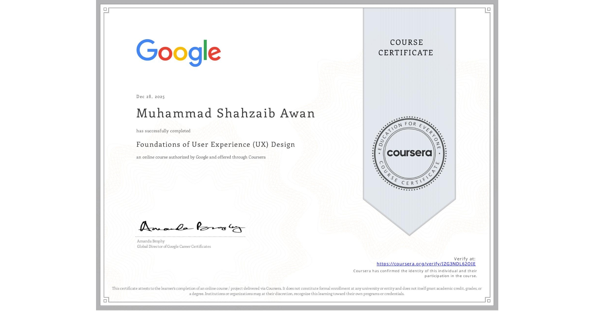</a>

<a href="https://www.coursera.org/account/accomplishments/verify/ZKQJSPNECAKB">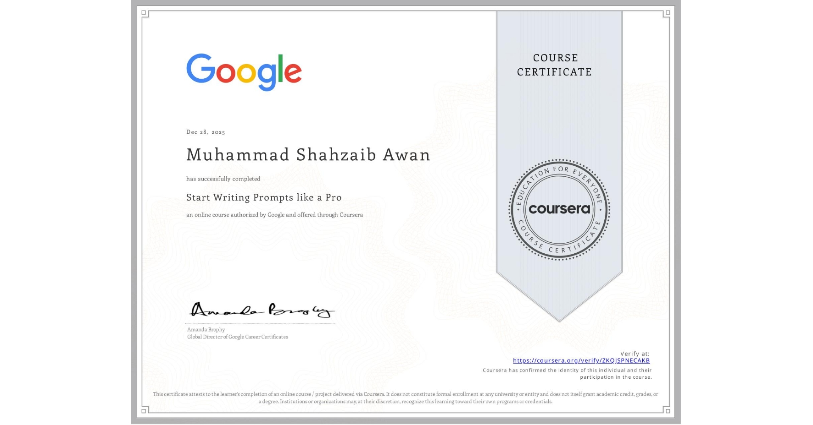</a>

<b>📋 Full list with verification links</b>

 

| Certificate | Issuer | Verification |
|---|---|---|
| AI Fluency Framework & Foundations | Anthropic | [Verify](https://verify.skilljar.com/c/9f4w2bqe7csi) — ID `9f4w2bqe7csi` |
| Google AI | Coursera | [Verify](https://www.coursera.org/account/accomplishments/specialization/PKZCLA6OA0QD) — ID `PKZCLA6OA0QD` |
| What Is Generative AI | LinkedIn Learning | [Verify](https://www.linkedin.com/learning/certificates/6053124f905ce9a3ae579f7e47b37efdc7507d39d4afa6fab9b6140c7115e759/) — ID `6053124f9...15e759` |
| Building AI Agents with Snowflake | GeeksforGeeks | [Verify](https://media.geeksforgeeks.org/courses/certificates/d8543e8a67a4d90346f2a2d1913e7235.pdf) |
| AI-Powered Design with Google Stitch | DataCrumbs | *no public link* |
| Mastering AI Email Agents Masterclass | DataCrumbs | *LinkedIn login required* |
| N8N Chatbot Lab | DataCrumbs | *LinkedIn login required* |
| Google Advanced Data Analytics | Coursera | [Verify](https://www.coursera.org/account/accomplishments/specialization/8Y2DQ4NOXAWK) — ID `8Y2DQ4NOXAWK` |
| Google Data Analytics | Coursera | [Verify](https://coursera.org/share/731510ab56142677507f774dd9d85fbb) |
| Data Science and Analytics | HP | [Verify](https://www.life-global.org/certificate/f7c9c0b3-4035-4793-8634-617a91b4f438) |
| AI for Business Professionals | HP | [Verify](https://www.life-global.org/certificate/3748f28a-a7b5-4820-b9e5-17f1cc90e3e6) |
| Google Cybersecurity | Coursera / Google | [Verify](https://www.credly.com/badges/b4b2a3e8-56c0-43c5-898a-530a082f5a93) |
| Google IT Automation with Python | Coursera | [Verify](https://www.coursera.org/account/accomplishments/specialization/MYX366FMLIUY) — ID `MYX366FMLIUY` |
| Operating Systems and You: Becoming a Power User | Coursera | [Verify](https://coursera.org/share/fa2fa7df683a24d2869e354aba686d86) |
| Foundations of User Experience (UX) Design | Coursera | [Verify](https://coursera.org/share/3a70add422b6087e8dfd0d848edabf2c) |
| Start Writing Prompts like a Pro | Coursera | [Verify](https://www.coursera.org/account/accomplishments/verify/ZKQJSPNECAKB) |

---

### 📊 GitHub Stats

 

 

 

---

### 🐍 Contribution Snake

<picture>
  <source media="(prefers-color-scheme: dark)" srcset="https://raw.githubusercontent.com/shahzeb121-oss/shahzeb121-oss/output/github-contribution-grid-snake-dark.svg">
  
</picture>

<picture>
  <source media="(prefers-color-scheme: dark)" srcset="https://readme-typing-svg.demolab.com/?font=Georgia&weight=600&size=26&duration=4000&pause=2000&color=FFFFFF&center=true&vCenter=true&width=750&height=60&lines=%22Every+commit+is+a+step+toward+building+intelligent+solutions.%22">
  
</picture>

